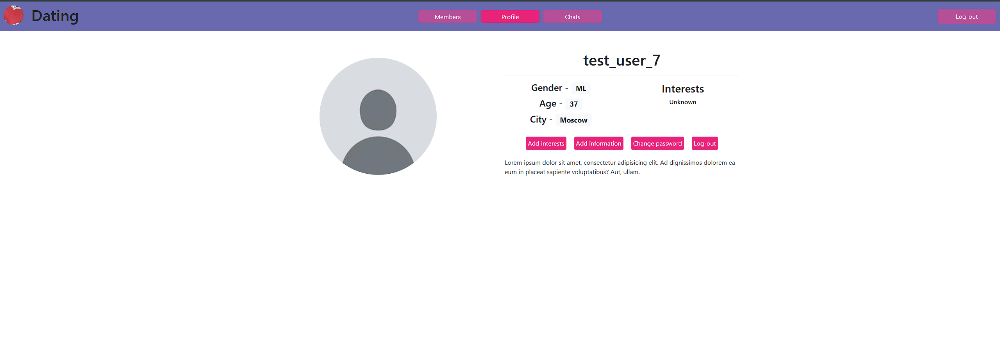
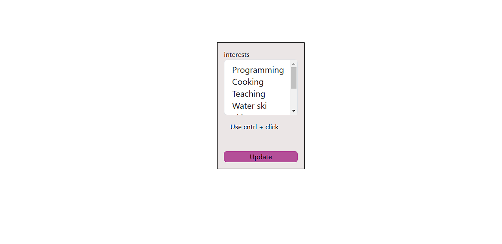
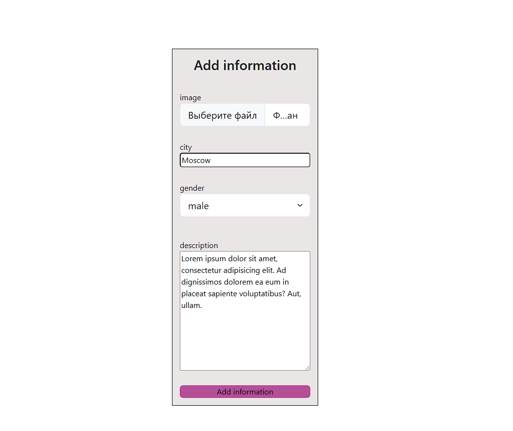
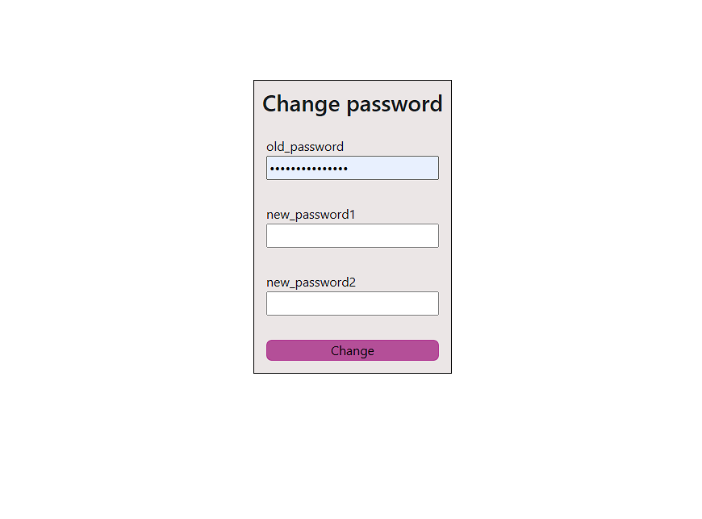
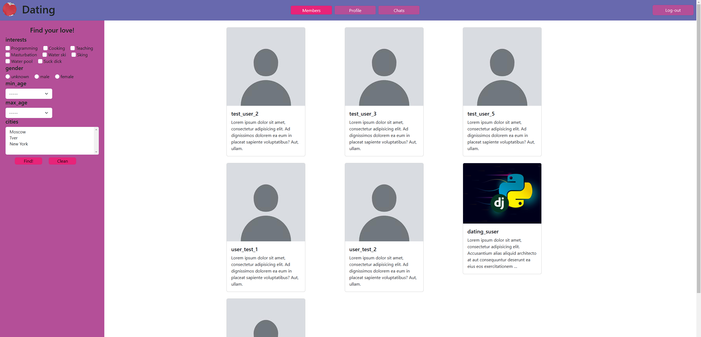
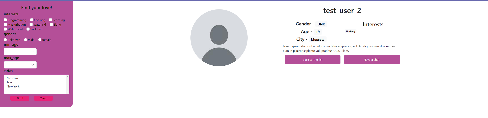

# Dating-site

Dating site is a place where people can find their love, they can filter people by different points 
it makes findings more powerfull because every person can find the same person as he.
Moreover, after person found he`s love, he can have a chat with her. Converwsation is safe and understandable to use.

# Short explanation of how the site works

## Profile page

To begin with, I want to start with profile page, but we can`t access profile page before creation account and log-in.
First step to user site is login:

But if you haven`t got any account, you should register

After registration all users turns up their profile page which contains all information they have entered

Profile page contains profile actions to manage user`s account such as 
 
- Add interests button to select your interests
     
- Add information to add additional information 
     
- Change password
    
- And Log-out button

## Members page

The main page of the site is a members page. On this page user can filter another users by different points such as:
- Interests 
- gender
- min/max age
- city

If user clicks on another user`s card he turns up on the detail page which contains two buttons 
- Back to the list (With the same filters)
- Have a chat, If user press this button, he will turns up on the Chats page and chat will be created

## Chats page

When user clicks 'have a chat' button on the server a chat will be created, user can see all chats on chats page, 

