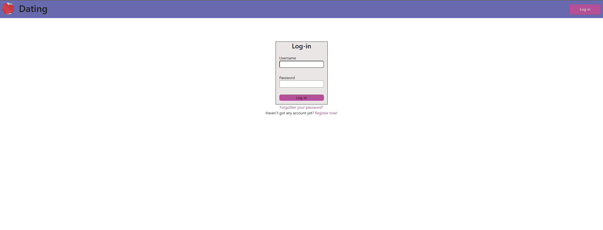
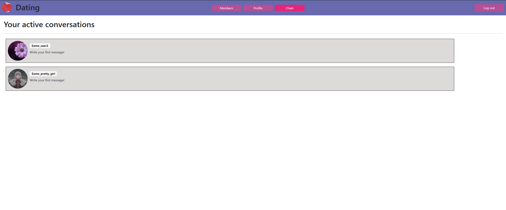

# Dating-site

Dating site is a place where people can find their love, they can filter people by different points 
it makes findings more powerfull because every person can find the same person as he.
Moreover, after person found he`s love, he can have a chat with her. Converwsation is safe and understandable to use.

# Short explanation of how the site works

## Profile page

To begin with, I want to start with profile page, but we can`t access profile page before creation account and log-in.
First step to user site is login:



But if you haven`t got any account, you should register


After registration all users turns up their profile page which contains all information they have entered


Profile page contains profile actions to manage user`s account such as 
 
- Add interests button to select your interests
     
- Add information to add additional information 
     
- Change password
    
- And Log-out button


## Members page

The main page of the site is a members page. On this page user can filter another users by different points such as:
- Interests 
- gender
- min/max age
- city


If user clicks on another user`s card he turns up on the detail page which contains two buttons 
- Back to the list (With the same filters)
- Have a chat, If user press this button, he will turns up on the Chats page and chat will be created


## Chats page

When user clicks 'have a chat' button on the server a chat will be created, user can see all chats on chats page, 



Each chat contains two users, and both users can hava a chat. For example: chat between dating_suser and Some_pretty_girl (different browsers).
All messages will be saved after user wil quit chat.


# Interesting implementation features

## Messages saving

To improve user experience, message is processing in several steps.

Firstly, after user has pressed the "Sent message" button, message is displaying on the both screens (with js).

```javascript
const data = JSON.parse(event.data);
const chat = document.getElementById('targetChat');
const current_date = new Date(data.sent).toLocaleString('ru');
const isMe = data.user_id === member1Id;
const messageClass = isMe ? 'my-message' : 'other-message';

chat.innerHTML += `<div class="${messageClass}">
                     <span class="badge text-bg-secondary">
                       ${data.user_username} ${current_date}
                     </span>
                     <p>
                       ${data.message}
                     </p>
                   </div>`;
```

Secondly, from the javascript, a POST request is sending on a "message_save" view where message data is processing

```python
@require_POST
def message_save(request) -> JsonResponse:
    form = SaveMessageForm(request.POST)
    if form.is_valid():
        cd = form.cleaned_data

        save_message.delay(request.user.id,
                           cd['chat_id'],
                           cd['content'])

        return JsonResponse({'status': 'saved'})
    return JsonResponse({'status': 'error'})
```

And Finally, "message_save" view creates a celery task to save message in database asynchronously.

```python
@shared_task(ignore_result=True)
def save_message(user_id, chat_id, content):
    user = DatingUser.objects.get(id=user_id)
    chat = Chat.objects.get(id=chat_id)
    Message.objects.create(
        content=content,
        sender=user,
        chat=chat)
```

This implementation doesn`t make user to wait